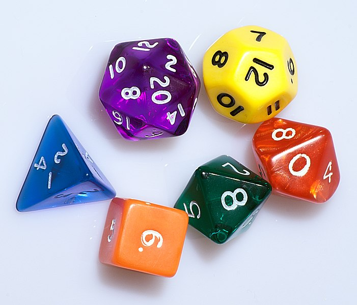
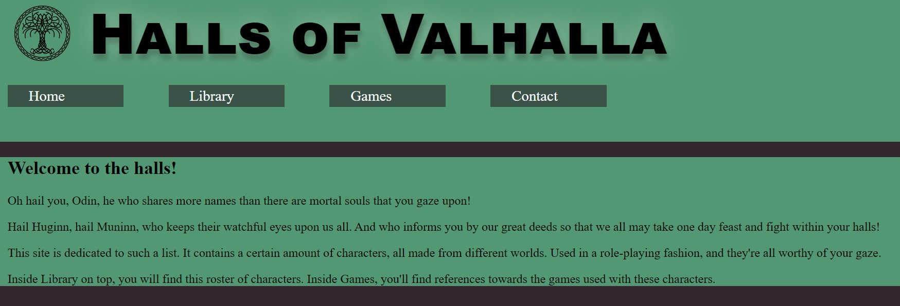
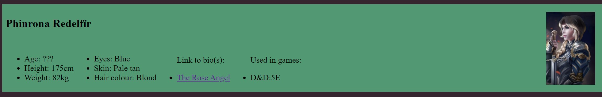
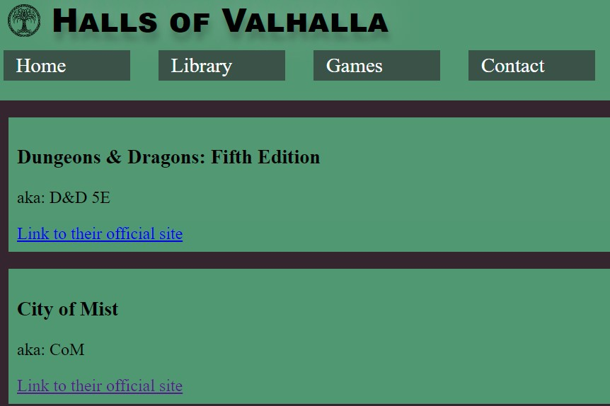

# The halls of Valhalla

This site is a place to share works done for RolePlaying games. Hopefully, it can not only help display characters, but also inspire people not knowing what to create.

## Features 

In this section, you should go over the different parts of your project, and describe each in a sentence or so. You will need to explain what value each of the features provides for the user, focusing on who this website is for, what it is that they want to achieve and how your project is the best way to help them achieve these things.

### Existing Features

- __Navigation Bar__

  - Featured on all three pages, the full responsive navigation bar includes links to the Logo, Home page, Library where all the characters are and contact page and is identical in each page to allow for easy navigation.
  - This section will allow the user to easily navigate from page to page across all devices without having to revert back to the previous page via the ‘back’ button. 

- __The tree of life__

  - Although nothing exclusive to this site, the Tree of Life is a ancient symbol that makes its pressence known on this site.
  - It is the crossroad in Norse mythology, and is deeply connected with Valhalla
  - On smaller devices, automatically hide the title for less clutter

- __Home menu__

  - This is the main page, it is here you'll be drawn into the space, and to get into the atmosphere created in this site.

- __Library__

  - Where all characters exist and are listed.
  - Automatically hide images on small screens for better visibility of content
  - There is a small list of how they appear
  - As well as a image for visual aid
  - As well as a link to their backstories
  - And information about what system they're created in.

- __Games__

  - Here, you can aquire links to all the systems specified for further infomration about them

- __Comtact__

  - Here, visitors can send you an email.
  - Maybe to just get in tough
  - Maybe to propose their own character
  - Maybe to just express how much they enjoy this idea of a site

### Features Left to Implement

- More streamlined library, able to filter and read from database as well as easier adding new ones.
- Better solution for games
- Way of use character image as background with still visible text above when screen is small

## Testing 

Thorough testing done using multiple explorers as well as rezising them in inspection mode as well as opening the document on my phone and tablet to ensure as pleasant of an experience on as many platforms as possible.

Most everything is responsive, and will scale to the needs of most any screen sizes and orientations today on the market.

During testing and debugging, I found it delightfully challenging to ensure propper allignment of character portraits alligned with complementary text. It took me plenty of tries, but I got there in the end!

### Validator Testing 

- HTML
  - No errors were returned when passing through the official [W3C validator](https://validator.w3.org/nu/?doc=https%3A%2F%2Fcode-institute-org.github.io%2Flove-running-2.0%2Findex.html)
- CSS
  - No errors were found when passing through the official [(Jigsaw) validator](https://jigsaw.w3.org/css-validator/validator?uri=https%3A%2F%2Fvalidator.w3.org%2Fnu%2F%3Fdoc%3Dhttps%253A%252F%252Fcode-institute-org.github.io%252Flove-running-2.0%252Findex.html&profile=css3svg&usermedium=all&warning=1&vextwarning=&lang=en#css)

### Unfixed Bugs

- Contact message form I still need to fix
- Contact form unusable at this moment

## Deployment

The live link can be found here - https://sodori.github.io/halls-of-valhalla/ 

## Credits 

In this section you need to reference where you got your content, media and extra help from. It is common practice to use code from other repositories and tutorials, however, it is important to be very specific about these sources to avoid plagiarism. 

You can break the credits section up into Content and Media, depending on what you have included in your project. 

### Content 

- The text for the Home page was taken from Wikipedia Article A
- Instructions on how to implement form validation on the Sign Up page was taken from [Specific YouTube Tutorial](https://www.youtube.com/)
- The icons in the footer were taken from [Font Awesome](https://fontawesome.com/)

### Media

- The photos used on the home and sign up page are from This Open Source site
- The images used for the gallery page were taken from this other open source site
